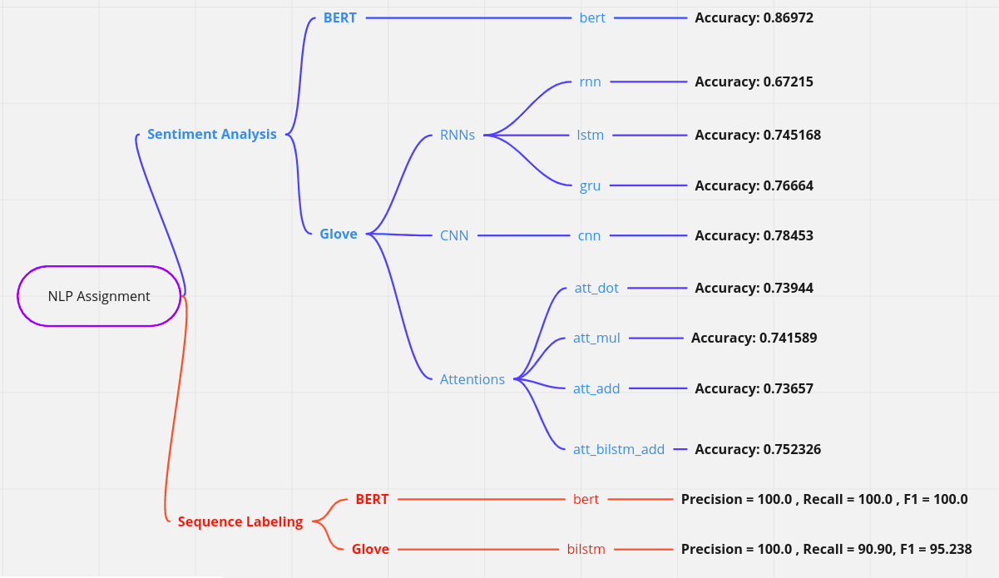
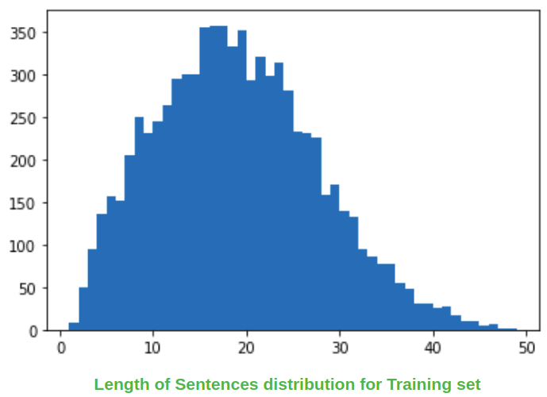
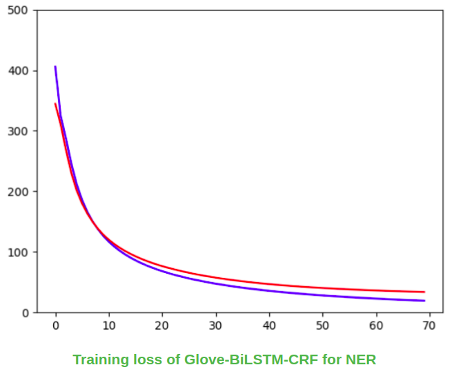
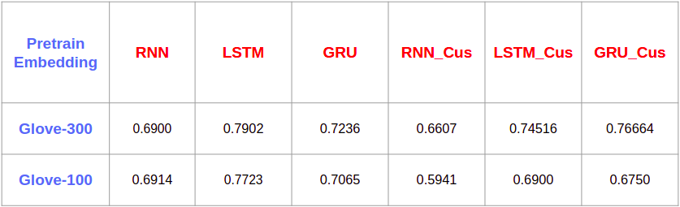
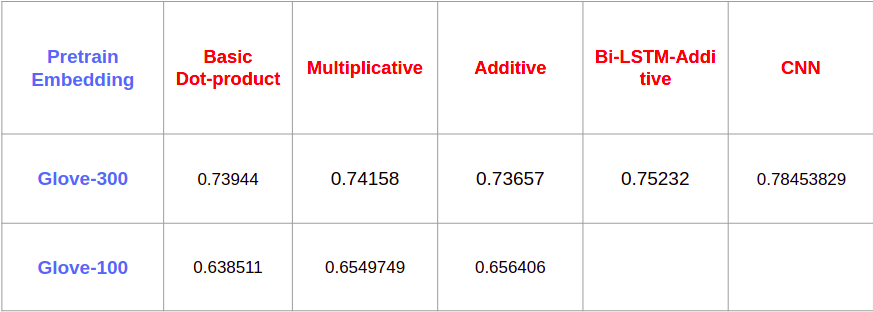
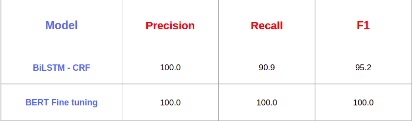

# NLP Assignment

 :smile: :heart_eyes: Accessing github and checking out Colab with is the easiest way to evaluation, I have set up all the environment and all script for evaluation there :smile: :heart_eyes:

```
https://github.com/NoahDrisort/NLPSample
```

#### Evaluation on Colab

Check this for all Report

[](https://colab.research.google.com/drive/19ESYq7LEqNHEhWhswXNhV8E3ET0C9M3k?usp=sharing)



#### Evaluation on Server

Setup

```
conda create -n assignment python=3.7
conda activate assignment
python -m pip install -r requirements.txt
```
Train/Evaluate
```
shell run.sh <mode> <problem> <model>
```
With:
* **mode** is  <train|evaluation>
* **problem** is <sentiment|sequence>
* **problem** is **sentiment** , avaiable models are: <bert|rnn|lstm|gru|cnn|att_add|att_mul|att_dot|att_bilstm_add>
* **problem** is **sequence** , avaiable models are: <bert|bilstm>

Example:
```
shell run.sh train sentiment lstm
```







#### Get pretrain of all model

[](https://drive.google.com/drive/folders/1Zulcr2Lp5l8VAV0K7XzG641ffXcfqnxP?usp=sharing)

Put the **checkpoints** folder in project folder **NLPSample/checkpoints**
```
shell run.sh evaluation <problem> <model>
```
